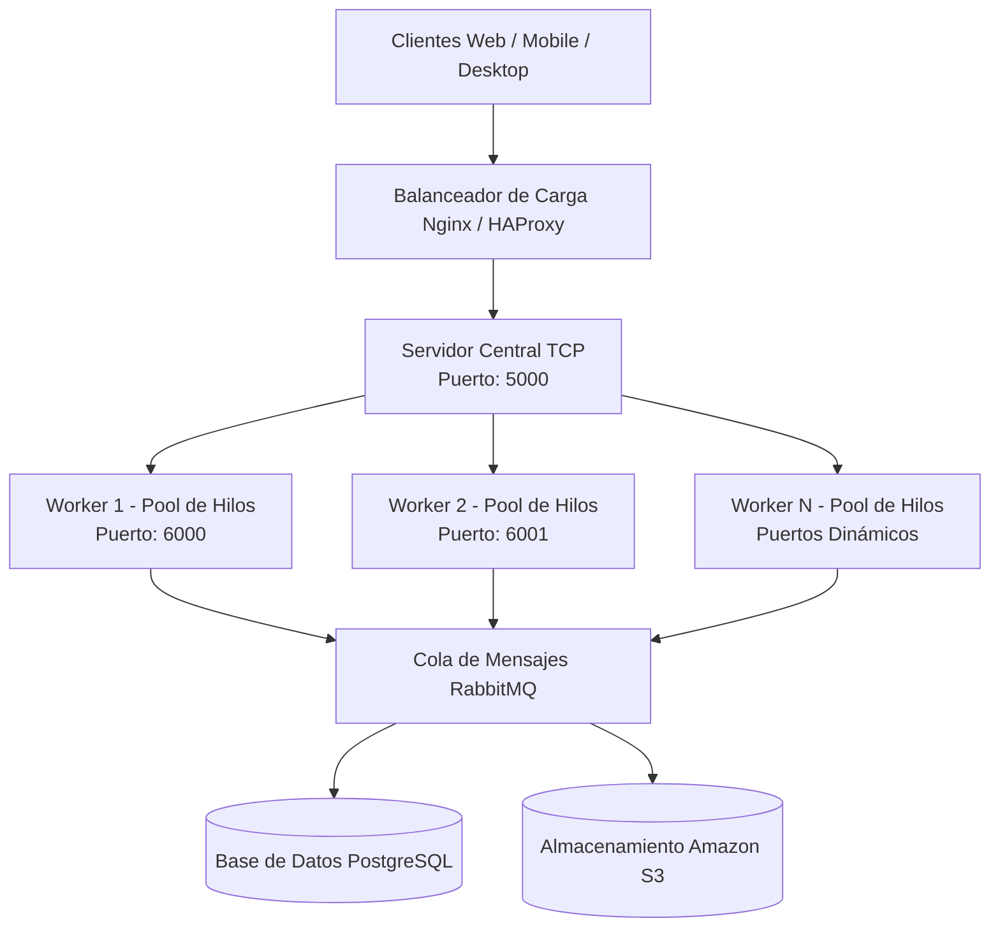

# PFO 3 - Rediseño de Gestión de Tareas como Sistema Distribuido

## Descripción

Mejora de la plataforma de gestión de tareas técnicas (PFO 2) para transformarla en un sistema de trabajo distribuido en equipo mediante sockets TCP nativos.

La arquitectura implementa:

- Emisión de solicitudes en Cliente TCP
- Servidor Central como intermediario con algoritmo de balanceo
- Envío de datos estructurados con JSON
- Múltiples Workers independientes encargados del procesamiento
- Grupo de hilos simultáneos (Pool) por cada Worker activo
- Almacenamiento acumulativo en memoria (Persistencia simulada)

---

# Arquitectura

El diseño conceptual de la infraestructura ideal pensada a gran escala en la nube se organiza de la siguiente manera:



---

# Estructura

```text
REDES_PFO3/
│
├── cliente.py          # Emisor de tareas en formato JSON
├── servidor_central.py # Recepción de solicitudes y balanceo Round Robin
├── worker.py           # Procesamiento concurrente capaz de clonarse por puerto
└── README.md           # Guía explicativa del sistema
```

# Ejecución

## 1. Encender el Worker 1 (Puerto 6000)

```bash
python worker.py 6000
```

---

## 2. Encender el Worker 2 (Puerto 6001)

```bash
python worker.py 6001
```

---

## 3. Encender la recepción (Servidor Central)

```bash
python servidor_central.py
```

---

## 4. Enviar tareas técnicas (Cliente)

```bash
python cliente.py
```

Si se ejecuta el cliente por primera vez, se puede observar en la terminal del Servidor Central, cómo deriva la orden al Worker 6000. Si se vuelve a ejecutar el cliente de inmediato, el Servidor la deriva automáticamente al Worker 6001, demostrando la distribución de carga.

---


# Funcionalidades

- *Creación y envío de tareas técnicas:* Permite generar solicitudes de soporte de forma remota.
- *Clasificación automática:* Separa la información por nivel de prioridad e ID del usuario técnico.
- *Mensajería organizada mediante JSON:* Los datos viajan empaquetados en un formato limpio en vez de texto libre.
- *Distribución por Round Robin:* El Servidor Central reparte de forma equitativa el peso del procesamiento alternando entre los puertos de los operarios.
- *Trabajo simultáneo con múltiples hilos:* Capacidad para atender múltiples clientes al mismo tiempo en cada nodo.
- *Almacenamiento en memoria independiente:* Los registros se van acumulando de manera aislada en la terminal del Worker que los procesó.
- *Mensajes de respuesta con trazabilidad:* El cliente recibe el puerto e hilo interno exacto que resolvió su pedido.

---

# Tecnologías

- Python 3
- socket
- concurrent.futures
- json

---

# Explicación del funcionamiento del sistema

Este proyecto es una evolución del sistema de gestión de tareas desarrollado anteriormente, pero rediseñado para que el trabajo se reparta en equipo entre diferentes programas a través de la red, usando sockets TCP en Python.

El sistema funciona mediante tres roles bien definidos:

- *El cliente:* Genera los datos de la tarea técnica (título, prioridad e ID del usuario) y los empaqueta de forma ordenada usando etiquetas JSON para enviarlos por la red al puerto 5000.
- *El servidor central:* Actúa como el recepcionista de la entrada. Recibe el paquete JSON del cliente y, aplicando un algoritmo Round Robin, decide de manera balanceada a qué operario interno derivarle el pedido (alternando entre los puertos 6000 y 6001) para que nadie trabaje de más.
- *El worker u operario:* Trabaja de forma interna en su puerto asignado. Recibe el paquete, lee los datos y los guarda en su lista de memoria. Para hacer varias cosas a la vez sin trabar el sistema de red, usa un grupo de hilos (ThreadPoolExecutor) resolviendo solicitudes en simultáneo.

Al terminar, el sistema le envía una confirmación al cliente avisándole que la tarea se guardó con éxito y le detalla exactamente qué puerto e hilo interno se encargó de procesar su solicitud.

---

# Autora

Mariela Belén Giménez

---

Instituto de Formación Técnica Superior N° 29  

Tecnicatura Superior en Desarrollo de Software  
