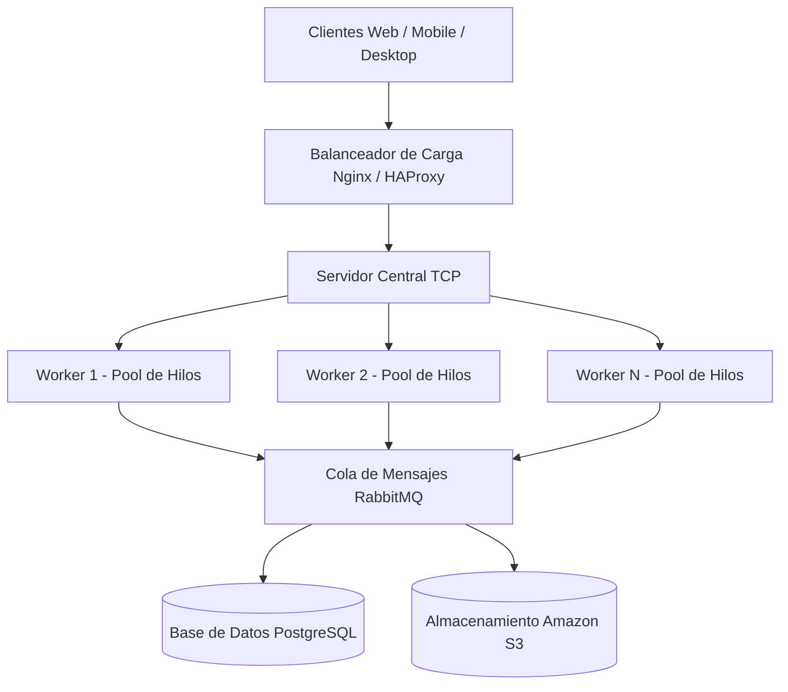

# PFO 3 - Rediseño de Gestión de Tareas como Sistema Distribuido

## Descripción

Mejora de la plataforma de gestión de tareas técnicas (PFO 2) para transformarla en un sistema de trabajo distribuido en equipo mediante sockets TCP nativos.

La arquitectura implementa:

- Emisión de solicitudes en Cliente TCP
- Servidor Central como intermediario de red
- Envío de datos estructurados con JSON
- Workers independientes encargados del procesamiento
- Grupo de hilos simultáneos (Pool) por Worker
- Almacenamiento acumulativo en memoria (Persistencia simulada)

---

# Arquitectura

El diseño conceptual de la infraestructura ideal pensada a gran escala en la nube se organiza de la siguiente manera:



---

# Estructura

```text
REDES_PFO3/
│
├── cliente.py          # Emisor de tareas en formato JSON
├── servidor_central.py # Recepción de solicitudes y derivación interna
├── worker.py           # Procesamiento concurrente con hilos y almacenamiento
└── README.md           # Guía explicativa del sistema
```

# Ejecución

## 1. Encender el sector interno (Worker)

```bash
python worker.py
```

---

## 2. Encender la recepción (Servidor central)

```bash
python servidor_central.py
```

---

## 3. Enviar una tarea técnica (Cliente)

```bash
python cliente.py
```

---

# Funcionalidades

- *Creación y envío de tareas técnicas:* Permite generar solicitudes de soporte de forma remota.
- *Clasificación automática:* Separa la información por nivel de prioridad e ID del usuario técnico.
- *Mensajería organizada mediante JSON:* Los datos viajan empaquetados en un formato limpio en vez de texto libre.
- *Trabajo simultáneo con múltiples hilos:* Capacidad para atender múltiples clientes al mismo tiempo.
- *Almacenamiento en memoria que retiene los datos:* Los registros se van acumulando de forma real en el Worker.
- *Mensajes de respuesta con trazabilidad:* El cliente recibe el número del hilo interno exacto que procesó su pedido.
- *Sistema multicliente sin bloqueos de red:* La recepción nunca se traba mientras se procesan las tareas internas.

---

# Tecnologías

- Python 3
- socket
- concurrent.futures
- json

---

# Explicación del funcionamiento del sistema

Este proyecto es una evolución del sistema de gestión de tareas desarrollado anteriormente, pero rediseñado para que el trabajo se reparta en equipo entre diferentes programas a través de la red, usando sockets TCP en Python.

El sistema funciona mediante tres roles bien definidos:

- *El cliente:* Genera los datos de la tarea técnica (título, prioridad e ID del usuario) y los empaqueta de forma ordenada usando etiquetas JSON para enviarlos por la red.
- *El servidor central:* Actúa como el recepcionista de la entrada en el puerto 5000. Recibe el paquete JSON del cliente y, para no demorarse ni hacer fila, se lo pasa inmediatamente al operario interno.
- *El worker u operario:* Trabaja de forma interna en el puerto 6000. Recibe el pedido, desarma el JSON para leer los datos y los guarda en una lista que simula una base de datos. Para hacer varias cosas a la vez, este operario usa un grupo de hilos (ThreadPoolExecutor) que procesan diferentes solicitudes al mismo tiempo.

Al terminar, el sistema le envía una confirmación al cliente avisándole que la tarea se guardó con éxito y le detalla exactamente qué hilo interno fue el encargado de resolver su pedido.

---

# Autora

Mariela Belén Giménez

---

Instituto de Formación Técnica Superior N° 29  

Tecnicatura Superior en Desarrollo de Software  
